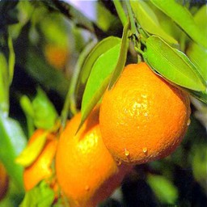

# Cycle_GAN-and-Application

Related Paper :
  * Neural Style Transfer : https://www.cv-foundation.org/openaccess/content_cvpr_2016/papers/Gatys_Image_Style_Transfer_CVPR_2016_paper.pdf

  * Improve Neural Style Transfer InstanceNormalization : https://arxiv.org/pdf/1607.08022.pdf

  * UNet : https://arxiv.org/pdf/1505.04597.pdf
  
  * Pix2Pix PatchGAN : https://arxiv.org/pdf/1611.07004.pdf

Dataset : https://drive.google.com/file/d/1DpKOV1VOZPU2MXDCpV9mhaEFwyRJ8nR1/view?usp=sharing

Apple orange cycle weights : https://drive.google.com/drive/folders/1hiPWVHZzS63nyzzMu3xT698-gzAgOUuU?usp=sharing

## Result Orange2Apple

## Own Designed Dataset

training now
